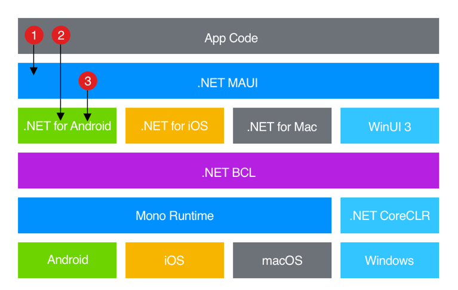

<!-- https://gist.github.com/rxaviers/7360908 -->

 

# .NET MAUI
#### Object Oriented Patterns in Cross Platform Development

---

# What is .NET MAUI

---

---
## Model View View-Model

- Architectural pattern
- Divides the architecture in **three** main components
  - **Model** (described using POCO classes)
  - **View Model** (where the business logic resides)
  - **View** (where the GUI is declared)
- The framework provides various way to **decouple** the View from the View-Model

---

https://gist.github.com/rxaviers/7360908

