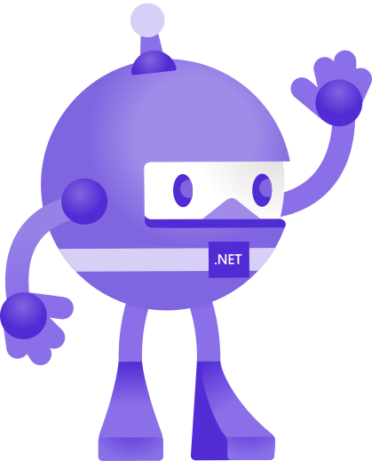

<!-- https://gist.github.com/rxaviers/7360908 -->

<!-- _footer: "<h2>Andrea Cantarutti   A.A. 2022/2023  </h2>" -->

# .NET MAUI
#### Object Oriented Patterns in Cross Platform Development

---

# What is .NET MAUI

- A **Microsoft Framework** built on top of .NET
- Successor of Xamarin.Forms
- Allows for cross-platform development from a single **C#** code-base
- Provides a series of features such as:
  - A **layout engine**
  - **Multiplatform APIs**
  - **Hot Reload**

_Write once, run everywhere_

---

---

---

## Model View View-Model

- Architectural pattern
- Divides the architecture in **three** main components
  - **Model** (described using POCO classes)
  - **View Model** (where the business logic resides)
  - **View** (where the GUI is declared)
- The framework provides various ways to **decouple** the View from the View-Model

